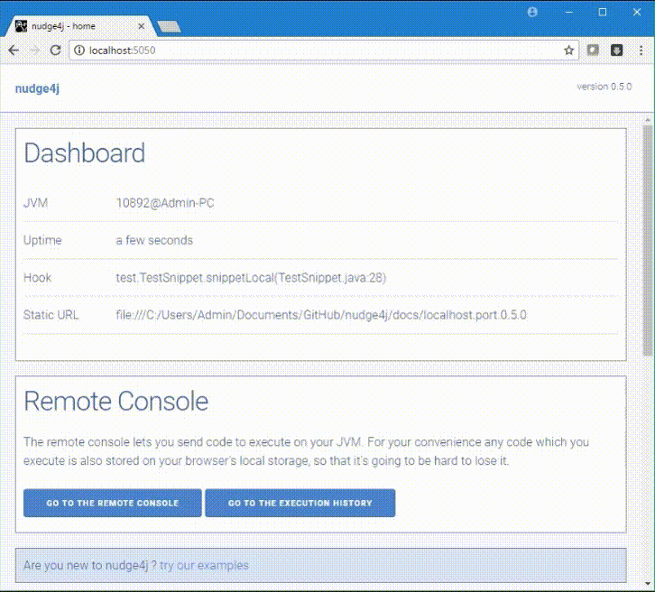

## Overview

- control your Java application from the browser, as if the browser was a smarter remote control.
- send code from the browser to run on the JVM, 
- experiment with live code. 

## Issues

Report any issue using GitHub and use notifications to track progress on them.

## Contributing

Want to hack on this project? Any kind of contribution is welcome! But I am particularly interested in Nashorn/JavaScript samples to add in the example section. 

## License

This project is licensed under the MIT license.
